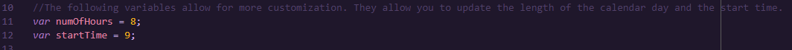
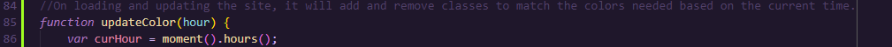

# Virtual Day Planner
This color coated day planner will help to organize your day! The green hours are future time, the gray hours are past time, and the red hour is the current time!

This site can be activated by going to the [GitHub deployed site](https://mmarsolek.github.io/DayPlanner/) or by right clicking in the [index.html](./index.html) page and selecting "Open in default browser". 

## Considerations
- All updates to the day planner are stored in local storage once the save button is hit.
- The time is formatted to display using the 12 hour format for a easy user experience while also being using the 24hour format in the script for an easy scripting experience. 
- The textareas are large for those that need lots of space. 
- The number of hour sections are dynamically created to allow for easy modification. Just update the startTime and numOfHours variables in the script.js file to add or remove hours. 
 
- Most CSS was provided by BootCamp Instructors.
- The text colors have been updated to a darker color to accommodate for those that have trouble seeing.
- Time is calculated using Moment JS library.

 

## Testing
- I manually changed the hour that the program thought it was in order to test the color changing of the text areas. I first tested to make sure it worked earlier that the first hour scheduled, I then tested to check that the colors worked if it was the end of the day, and also when it was in the middle of the day. This allowed to verify that it worked for all hours of the day. 